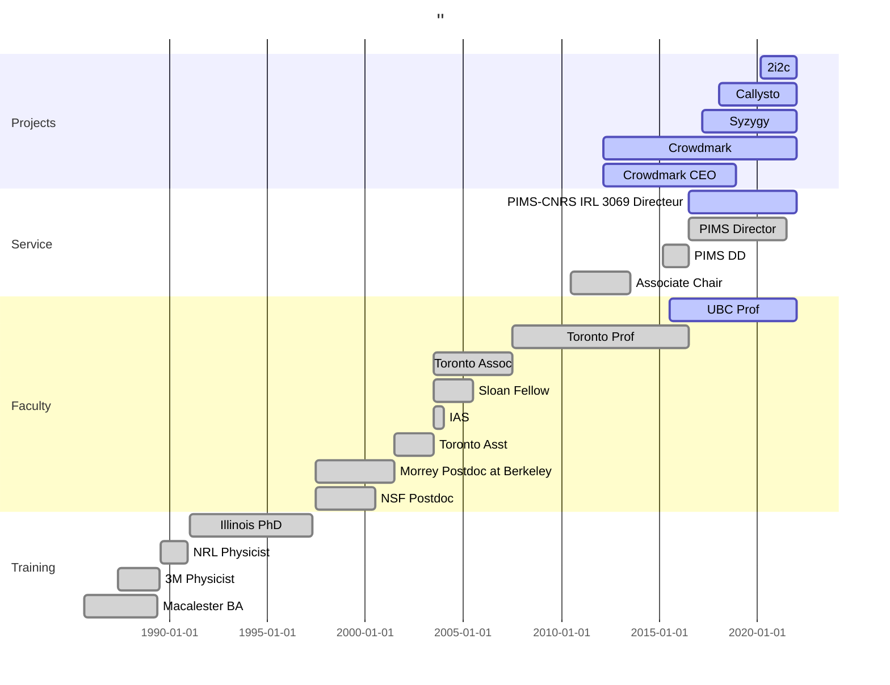

```mermaid
gantt
    dateFormat  YYYY-MM-DD
    title       ''
    section Projects
    2i2c  :active, p5, 2020-02-25,2021-12-31
    Callysto :active, p4, 2018-01-15,2021-12-31
    Syzygy :active, p3, 2017-03-15, 2021-12-31
    Crowdmark :active, p2, 2012-03-01, 2021-12-31
    Crowdmark CEO :active, p1, 2012-03-01, 2018-11-30
    section Service 
    PIMS-CNRS IRL 3069 Directeur :active, 2016-07-01, 2021-12-31
    PIMS Director :done, a4, 2016-07-01, 2021-06-30
    PIMS DD :done, a3, 2015-03-01, 2016-06-30
    Associate Chair :done, a2, 2010-07-01, 2013-06-30
    section Faculty
    UBC Prof      :active, f6, 2015-07-01, 2021-12-31
    Toronto Prof  :done, f5, 2007-07-01, 2016-06-30
    Toronto Assoc :done, f2, 2003-07-01,2007-06-30
    Sloan Fellow  :done, f3, 2003-07-01, 2005-06-30
    IAS    :done, f4, 2003-07-01, 2003-12-31 
    Toronto Asst  :done, f1, 2001-07-03, 2003-06-30
    Morrey Postdoc at Berkeley  :done, t5, 1997-07-01, 2001-06-30
    NSF Postdoc   :done, t6, 1997-07-01, 2000-06-30
    section Training
    Illinois PhD  :done, t4, 1991-01-15, 1997-04-15
    NRL Physicist :done, t3, 1989-07-15, 1990-12-15 
    3M Physicist     :done, t2, 1987-05-15, 1989-06-30
    Macalester BA :done, t1, 1985-09-01, 1989-05-15
```
