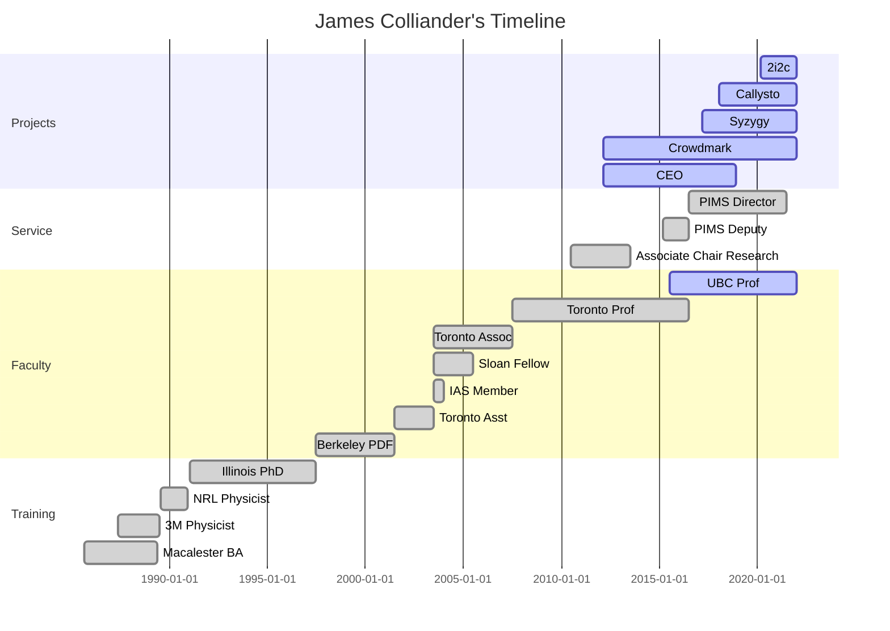
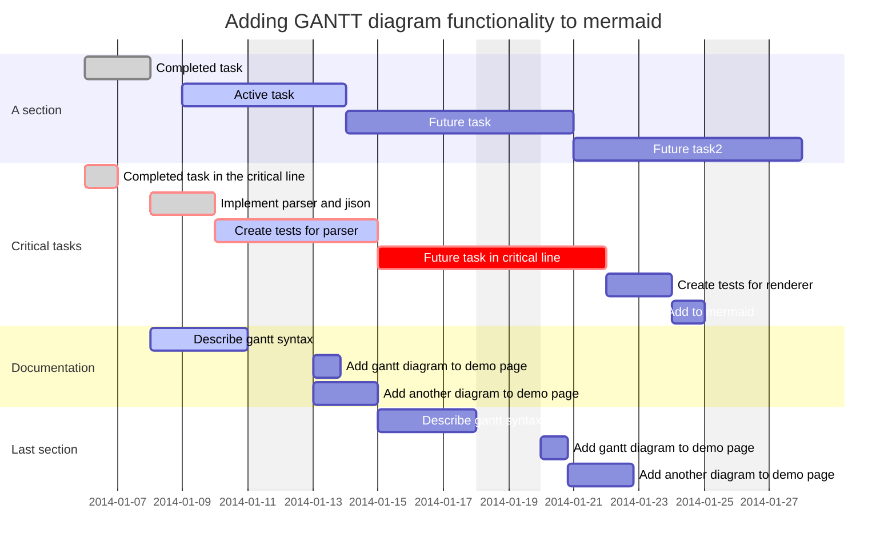

```mermaid
gantt
    dateFormat  YYYY-MM-DD
    title       James Colliander's Timeline
    section Projects
    2i2c  :active, p5, 2020-02-25,2021-12-31
    Callysto :active, p4, 2018-01-15,2021-12-31
    Syzygy :active, p3, 2017-03-15, 2021-12-31
    Crowdmark :active, p2, 2012-03-01, 2021-12-31
    CEO :active, p1, 2012-03-01, 2018-11-30
    section Service 
    PIMS Director :done, a4, 2016-07-01, 2021-06-30
    PIMS Deputy :done, a3, 2015-03-01, 2016-06-30
    Associate Chair Research :done, a2, 2010-07-01, 2013-06-30
    section Faculty
    UBC Prof      :active, f6, 2015-07-01, 2021-12-31
    Toronto Prof  :done, f5, 2007-07-01, 2016-06-30
    Toronto Assoc :done, f2, 2003-07-01,2007-06-30
    Sloan Fellow  :done, f3, 2003-07-01, 2005-06-30
    IAS Member    :done, f4, 2003-07-01, 2003-12-31 
    Toronto Asst  :done, f1, 2001-07-03, 2003-06-30
    Berkeley PDF  :done, t5, 1997-07-01, 2001-06-30
    section Training
    Illinois PhD  :done, t4, 1991-01-15, 1997-06-30
    NRL Physicist :done, t3, 1989-07-15, 1990-12-15 
    3M Physicist     :done, t2, 1987-05-15, 1989-06-30
    Macalester BA :done, t1, 1985-09-01, 1989-05-15
```

```mermaid
gantt
    dateFormat  YYYY-MM-DD
    title       Adding GANTT diagram functionality to mermaid
    excludes    weekends
    %% (`excludes` accepts specific dates in YYYY-MM-DD format, days of the week ("sunday") or "weekends", but not the word "weekdays".)

    section A section
    Completed task            :done,    des1, 2014-01-06,2014-01-08
    Active task               :active,  des2, 2014-01-09, 3d
    Future task               :         des3, after des2, 5d
    Future task2              :         des4, after des3, 5d

    section Critical tasks
    Completed task in the critical line :crit, done, 2014-01-06,24h
    Implement parser and jison          :crit, done, after des1, 2d
    Create tests for parser             :crit, active, 3d
    Future task in critical line        :crit, 5d
    Create tests for renderer           :2d
    Add to mermaid                      :1d

    section Documentation
    Describe gantt syntax               :active, a1, after des1, 3d
    Add gantt diagram to demo page      :after a1  , 20h
    Add another diagram to demo page    :doc1, after a1  , 48h

    section Last section
    Describe gantt syntax               :after doc1, 3d
    Add gantt diagram to demo page      :20h
    Add another diagram to demo page    :48h
```