<!-- .slide: data-background="./assets/media/images/jupiter-spot.jpg" -->

# <code>2i2c</code>

> A corporation with a mission to support people engaged in **interactive computing**.

International Interactive Computing Collaboration

<!-- .element: class="fragment" data-fragment-index="1" -->

----

## [James Colliander](https://colliand.com) 

 

<a href="https://twitter.com/colliand"><i class="fa fa-twitter"></i></a> <a href="https://github.com/colliand/"><i class="fa fa-github"></i></a> <a href="https://www.linkedin.com/in/james-colliander-9bb02465"><i class="fa fa-linkedin"></i></a>  <a href="https://www.youtube.com/user/JamesColliander"><i class="fa fa-youtube"></i></a> <a href="https://angel.co/colliand"><i class="fa fa-angellist"></i></a> <a href="mailto:colliand@math.ubc.ca"><i class="fa fa-envelope-o"></i></a>

::::info
These slides: [bit.ly/2i2c-berkeley](http://bit.ly/2i2c-berkeley)

[Video of this talk](https://www.youtube.com/watch?v=s0htaQQ2uAY)
::::

 

----

### Background

+ [Canadians Land on Jupyter](https://medium.com/pims-math/canadians-land-on-jupyter-ef5872720420)
+ [JupyterCon 2018](https://conferences.oreilly.com/jupyter/jup-ny/public/schedule/detail/68396)
+ [National Scale Interactive Computing](https://blog.jupyter.org/national-scale-interactive-computing-2c104455e062)
+ [Moore-Sloan Data Science Environments talk](https://bit.ly/2i2c-sf)
+ [Invitation: Help Found 2i2c!](https://hackmd.io/0LCxZnIKTx2oFLAhfgmBYg)

----

### PIMS: Distributed Mathematical Sciences Institute 

<iframe src="https://www.google.com/maps/d/u/0/embed?mid=1ksl7MJoVOSke-Z-M4svw7flkEuQ" width="640" height="480"></iframe>

---

# Inspirations

----

<!-- .slide: data-background="https://ten.blue/uploads/jupiter-spot.jpg" -->

----

### [Jessica Hamrick's Post](https://developer.rackspace.com/blog/deploying-jupyterhub-for-education/)

----

### [Data 8](http://data8.org/) at Berkeley

----

----

----

---

# Partners

----

----

<!-- .slide: data-background="https://ten.blue/uploads/jupiter-spot.jpg" -->

----

<!-- .slide: data-background="https://ten.blue/uploads/jupiter-spot.jpg" -->

---

# Idea: Jupyter for 🇨🇦

----

### Development History

```mermaid
gantt
    title Timeline

    section Syzygy
    23 universities, 10 research teams: 2020-02-25, 25d
    25,000 users : 2020-01-01, 25d
    16,000 users : 2019-08-22, 25d
    8,000 users : 2017-08-24, 25d
    Syzygy service announcement : 2017-03-15, 25d
    PIMS + Compute Canada Agreement : 2016-06-02, 25d
    Compute Canada Discussions : 2015-12-03, 2016-06-01
    Jessica Hamrick's Post : 2015-03-24, 25d
    JupyterHub for 🇨🇦 idea : 2015-02-01, 90d
    
    section Callysto
    CanCode 2.0 🇨🇦 $1.5M : 2019-10-15, 25d
    Callysto content creation : 2018-05-01, 2018-08-31
    CanCode 1.0 🇨🇦 $1.5M : 2018-01-30, 25d
    Callysto Launched: 2017-10-01, 25d
```

----

### [Syzygy](https://syzygy.ca/)

<!-- .slide: data-background="https://ten.blue/uploads/jupiter-spot.jpg" -->

<iframe src="https://www.google.com/maps/d/embed?mid=1nzSAGLSn8eWdfQ6K7zTw-31h82I&hl=en" width="640" height="480"></iframe>

----

<!-- .slide: data-background="https://ten.blue/uploads/jupiter-spot.jpg" -->

----

<!-- .slide: data-background="https://ten.blue/uploads/jupiter-spot.jpg" -->

----

### Research Teams

* Curated interactive HPC
* Perfect-barrier data integration
* Explosively collaborative
* Accelerate knowledge mobilization

----

### Examples

* [Pangeo](https://pangeo.io/)
* [Callysto](https://callysto.ca/)
* [QuantEcon](https://quantecon.org/)
* [bcdata](http://workshop.bcdata.ca/2018/)
* [Data Science for Albertans](http://www.cybera.ca/services/data-science/data-science-albertans/)
* [UBC Scientific Software Seminar](https://github.com/ubcs3/)
* [iReceptor](http://ireceptor.irmacs.sfu.ca/)
* [2018 Calgary PIMS Datathon](https://imstatsbee.github.io/calgaryr/datathon.html)
* [Phytoplankton Photophysiology Workshop](https://gitlab.com/tjryankeogh/phytophotoutils)
* Many, many, many, many more examples....

----

### Lessons Learned

* Research and education transforming
* Demand can be met with cloud strategy
* Scaling programs like Data 8 requires infrastructure

::::info
#### Sustainable business model needed ASAP.
::::

---

<!-- .slide: data-background="https://ten.blue/uploads/jupiter-spot.jpg" -->

# <code>2i2c</code>

> A corporation with a mission to support people engaged in **interactive computing**.

International Interactive Computing Collaboration

----

### <code>2i2c</code> Mission

+ Interactive computing as a service for higher ed
  + transparent pricing
  + perfect service level agreement
+ <code>2i2c</code> Labs
  + Expertise, best practices, collaboration
  + Embedded engineers for research projects
+ Reinvest in open source communities

  

::::success
#### Rigorous governance with university oversight.
::::

----

