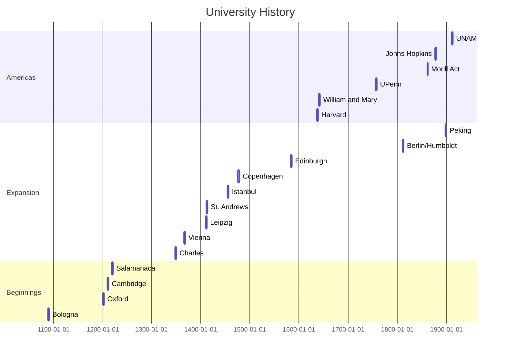

# Education and AI

Jim Colliander
 
[Northwest Grading and Assessment Summit](https://crowdmark.com/northwest-grading-assessment-summit-register/)  
Washington State University
2023-05-08

---

----

----

----

## 2023: Diamond Digital Jubilee!

| When? | Who? | What? |
| -------- | -------- | -------- |
| 1948-06-17    | J. Bardeen, W. Brattain | [Point-Contact Transistor](https://patents.google.com/patent/US2524035A/en?q=(Three-electrode+circuit+element+utilizing+semiconductive+materials)&oq=Three-electrode+circuit+element+utilizing+semiconductive+materials) |
| 1948-06-26| W. Shockley | [Junction Transistor](https://patents.google.com/patent/US2569347A/en?oq=US2569347A+Circuit+element+utilizing+semiconductive+material0) |
| 1948 July | C. Shannon | [Information Theory](https://people.math.harvard.edu/~ctm/home/text/others/shannon/entropy/entropy.pdf) |

----

### Bell Labs, 463 West Street, New York

<iframe width="425" height="350" frameborder="0" scrolling="no" marginheight="0" marginwidth="0" src="https://www.openstreetmap.org/export/embed.html?bbox=-74.01381433010103%2C40.73512462858149%2C-74.00774180889131%2C40.738152838822934&amp;layer=mapnik" style="border: 1px solid black"></iframe> <small><a href="https://www.openstreetmap.org/#map=18/40.73664/-74.01078">View Larger Map</a></small>

---

# Education

----

# Academia is a land acknowledgement 

----

# [Academus](https://en.wikipedia.org/wiki/Academus)

----

#### $A \Gamma \mbox{E} \Omega \mbox{METPHTO}\Sigma ~~ \mbox{MH}\Delta \mbox{EI} \Sigma ~~ \mbox{EI}\Sigma \mbox{IT} \Omega$ 

"Let none but geometers enter here"

----

<iframe width="425" height="350" frameborder="0" scrolling="no" marginheight="0" marginwidth="0" src="https://www.openstreetmap.org/export/embed.html?bbox=23.69158744812012%2C37.97877738545427%2C23.725147247314453%2C38.00397457329067&amp;layer=mapnik" style="border: 1px solid black"></iframe> <small><a href="https://www.openstreetmap.org/#map=15/37.9914/23.7084">View Larger Map</a></small>

----

### Academy

+ Pioneering social collaboration structure
+ Participants were "earth measurers"
+ "Academia" is a land acknowledgement

:::info
How should we name whatever we may invent here?
:::

----

## Plato's view of students

+ Sophists vs. Philosophers
+ Instruction via dialogue
+ Lifelong learning

----

### Educere

“to lead, draw or take out, forth or away”

----

# Education evolves

----

----

+ 1810: Berlin/Humboldt: [_Bildung_](https://en.wikipedia.org/wiki/Bildung) $\rightarrow$ JHU
+ [Economic motivations for education investment](https://www.ers.usda.gov/webdocs/publications/46955/31480_mp1583c_002.pdf?v=0)
    + [1862...: Morill Land Grant Act](https://www.archives.gov/milestone-documents/morrill-act); Colonial expansion
    + [1980: Bayh-Dole Act](https://en.wikipedia.org/wiki/Bayh%E2%80%93Dole_Act)
    + 2010...: Startup incubators and accelerators
+ 2012...: MOOCs

----

# Technology and education

----

### Socrates on Writing (Plato's Phaedrus)

"For this invention will produce forgetfulness in the minds of those who learn to use it, because they will not practice their memory. Their trust in writing, produced by external characters which are no part of themselves, will discourage the use of their own memory within them. You have invented an elixir not of memory, but of reminding; and you offer your pupils the appearance of wisdom, not true wisdom, for they will read many things without instruction and will therefore seem [275b] to know many things, when they are for the most part ignorant and hard to get along with, since they are not wise, but only appear wise." 

----

### Calculator will destroy education!

[History on calculators in education from 1975](https://files.eric.ed.gov/fulltext/ED525547.pdf)

----

# Purpose of education?

+ transfer knowledge?
+ human self-cultivation?
+ prepare for employment?

:::info
All of these? With what emphasis?
:::

----

“Education is the point at which we decide whether we love the world enough to assume responsibility for it, and by the same token save it from that ruin which except for renewal, except for the coming of the new and the young, would be inevitable. And education, too, is where we decide whether we love our children enough not to expel them from our world and leave them to their own devices, nor to strike from their hands their chance of undertaking something new, something unforeseen by us, but to prepare them in advance for the task of renewing a common world.” -- **Hannah Arendt**

---

# Crowdmark

----

## Mission

Enrich the learning and teaching experience for students and educators by transforming assessment into a **dialogue** for improvement.

----

## How to "dialogue" with 1,000 students?

  
    
      Use Technology!
    
  

----

## Recent work in progress

+ Lindsey Daniels
+ Connor Gregor
+ Caroline Junkins $\leftarrow$ scale prior work
+ Jim Colliander

----

## A student "baseball card"

+ Calculus Baseline Assessment (CPA)
+ Voice of student (using NLP + ML)
+ Attitudes Toward Mathematics Inventory (ATMI)

----

## Results

+ CBA + Voice of Student + ATMI data is a good predictor of student success
+ Data clusters to reveal student archetypes

----

----

----

----

----

----

1. Quantified Score: Proportion of correct multiple choice responses on the assessment
2. Mathematical Language: Introducing variables, definitions and/or equations as part of the problem-solving process
3. Visualization: Sketching a diagram and/or graph, or making use of graphing software (e.g. desmos.com)
4. Contextual Reasoning: Referecing real-world properties to gauge the validity of the solution
5. Heuristic View: Making use of tactics such as process of elimination or trial and error

----